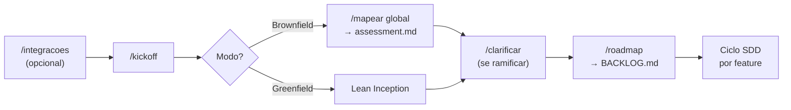
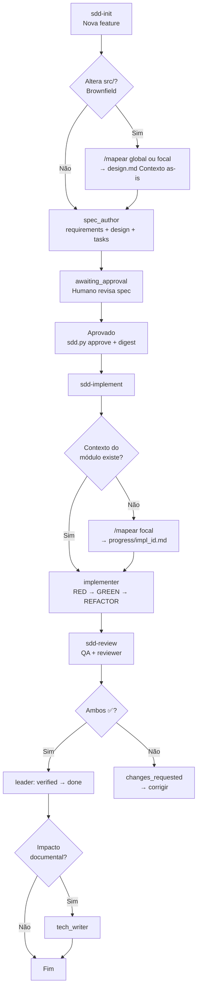
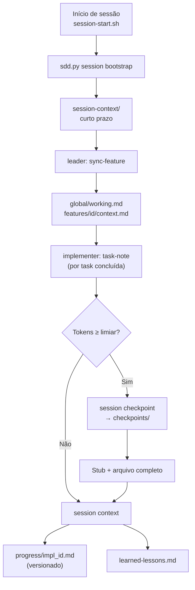
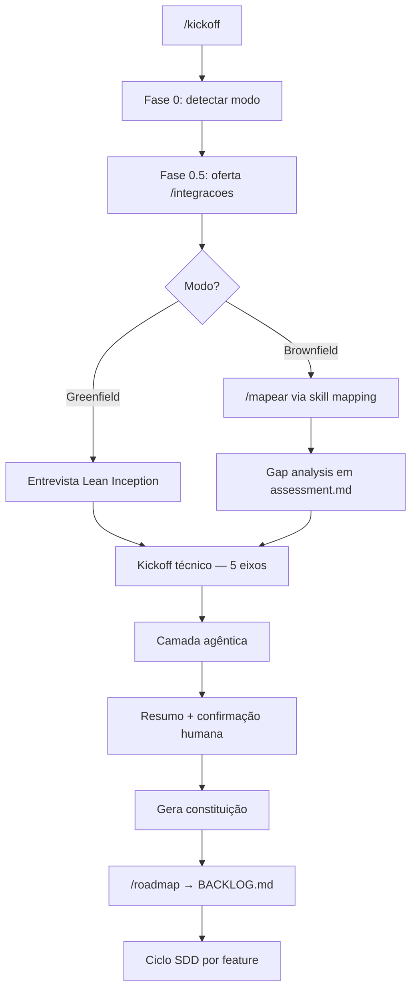
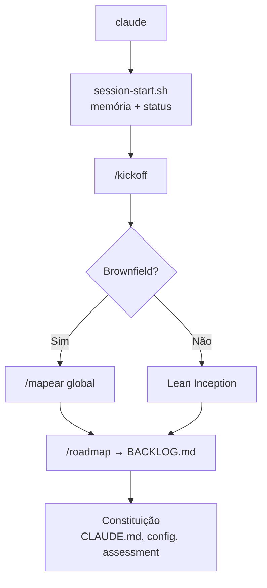
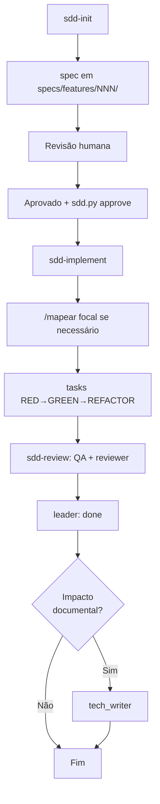

# sdd_harness_engineering

Template funcional de **Spec-Driven Development (SDD)** + **Harness Engineering**
para desenvolvimento assistido por IA.

---

## O que é isso?

| Conceito | O que faz |
|----------|-----------|
| **SDD** | Nenhum código de feature sem spec aprovada. Requisitos → design → tasks → código → revisão. |
| **Harness** | Infraestrutura que disciplina o agente: subagentes, skills, hooks, memória. |

```
Humano aprova spec  →  Agente implementa  →  sdd-review (QA + reviewer)
        ↑                                              ↓
   Hook bloqueia código sem spec aprovada
```

---

## Fluxos principais

Visão integrada do template. Detalhes por skill ficam nas seções abaixo e em `fluxoSdd.md`.

### Prelude do projeto (uma vez)



### Ciclo SDD por feature



| Fase | Skill / comando | Artefato principal |
|------|-----------------|-------------------|
| Spec | `sdd-init` + `spec_author` | `specs/features/<id>/` |
| Aprovação | humano + `sdd.py approve` | `status.json` + digest |
| Implementação | `sdd-implement` + `/mapear` focal | `progress/impl_<id>.md`, código, testes |
| Revisão | `sdd-review` | `reviews/qa-*.md`, `reviews/traceability-*.md` |
| Fechamento | `leader` | `status.json` → `done` |
| Documentação (opc.) | `tech_writer` | README, CLAUDE, `docs/` |

### `/mapear` global vs focal

Dois momentos distintos — não confundir:

| Tipo | Quando | Escopo | Saída |
|------|--------|--------|-------|
| **Global** | Kickoff brownfield, antes de specs | Repositório ou bounded context | `docs/architecture/assessment.md` |
| **Focal** | `sdd-init` ou `sdd-implement` (brownfield) | Só arquivos que as tasks vão tocar + vizinhos | `design.md` → `## Contexto as-is` e/ou `progress/impl_<id>.md` → `## Contexto do módulo` |

O **mapear focal** evita codar “no escuro”: documenta convenções locais, acoplamentos e riscos antes de editar `src/`.

### Memória de sessão (curto + longo prazo)

Roda em paralelo ao SDD — infraestrutura, não feature de produto.



| Nível | Pasta | Git |
|-------|-------|-----|
| Curto prazo | `.claude/session-context/` | Ignorado (exceto `_templates/`) |
| Longo prazo | `.claude/knowledge/checkpoints/` | Ignorado |
| Lições | `.claude/knowledge/learned-lessons.md` | Versionado |
| Por task | `progress/impl_<id>.md` | Versionado |

**Brownfield — layout antigo de session-context:** se o projeto já usava `progress.md` plano na raiz, rode uma vez `python3 .sdd/migrate_session_context.py --dry-run` antes do bootstrap. Projetos novos não precisam.

> **Cursor:** execute `python3 .sdd/sdd.py session bootstrap` manualmente se o hook SessionStart não rodar.

---

## Estrutura geral (independente do modelo de IA)

Pastas compartilhadas pelo processo SDD — qualquer agente de IA deve respeitar
este fluxo, mesmo que o harness de configuração mude por ferramenta.

```
.
├── AGENTS.md              # Processo SDD — COMO trabalhar (leitura obrigatória)
├── CLAUDE.md              # Contexto técnico — O QUE construir (adaptável por IA)
├── fluxoSdd.md            # Guia visual SDD + mapa de pastas
├── CLAUDE.local.md.example
├── .sdd/config.json       # Paths protegidos, comandos test/build/lint, sessionMemory
├── .sdd/sdd.py            # Guard, aprovação, digest, validação e memória de sessão
├── .sdd/migrate_session_context.py  # Migração brownfield de session-context legado
│
├── .claude/               # Harness Claude Code (subagentes, skills, hooks, memória)
│   ├── agents/            # leader, spec_author, implementer, QA, reviewer, tech_writer
│   ├── skills/            # kickoff, mapear, sdd-*, integracoes, clarificar, roadmap
│   ├── hooks/             # session-start.sh, pre-tool-use.sh
│   ├── knowledge/         # session_manager.py, checkpoints/, learned-lessons.md
│   └── session-context/   # Memória curta (gitignored) — global/, features/
│
├── specs/                 # SDD — especificações (fonte de verdade)
│   ├── BACKLOG.md
│   ├── README.md
│   └── features/NNN-nome/ # requirements, design, tasks, status, reviews/
│
├── progress/              # Logs de implementação (impl_<id>.md)
├── tests/                 # Testes com @covers FNNN-R<n> + tests/harness/ (Python)
├── memory/                # Spec de memória de sessão (memory.md)
├── docs/
│   ├── architecture/      # assessment.md, adr/ (ADR-001 session-context)
│   └── integrations/      # inventory.md — /integracoes
└── src/                   # Código de produção (protegido pelo hook SDD)
```

| Pasta / arquivo | Função |
|-----------------|--------|
| `specs/BACKLOG.md` | Backlog priorizado — ideias entram aqui como `pending` |
| `specs/features/NNN-nome/` | Spec completa de uma feature antes de codar |
| `specs/features/*/status.json` | Estado, aprovação vinculada à spec e revisões |
| `progress/impl_<id>.md` | Registro task ↔ requisito ↔ arquivos ↔ testes |
| `progress/current.md` | Feature ativa (gitignored — cópia de trabalho) |
| `tests/` | Prova rastreável de que cada `FNNN-R<n>` foi implementado |
| `tests/harness/` | Testes unitários de `sdd.py` e `session_manager.py` |
| `docs/architecture/assessment.md` | Bounded contexts e restrições — validado pelo QA na revisão |
| `docs/architecture/adr/` | Decisões arquiteturais (ex.: ADR-001 memória de sessão) |
| `docs/integrations/inventory.md` | Ferramentas do time — preenchido por `/integracoes` |
| `memory/memory.md` | Guia de implementação da memória curta/longa |
| `.sdd/config.json` | Paths protegidos, comandos test/build/lint, `sessionMemory` |
| `.sdd/sdd.py` | CLI: guard, validate, approve, digest, session * |
| `.claude/knowledge/session_manager.py` | Motor de memória curta/longa |

---

## Scripts Python (harness)

Sem dependências externas. Invocados pelos hooks e pelos agentes.

| Script | Função |
|--------|--------|
| `.sdd/sdd.py` | CLI: `guard`, `validate`, `approve`, `digest`, subcomandos `session` |
| `.claude/knowledge/session_manager.py` | `SessionManager` — memória curta (`.claude/session-context/`) e longa (`checkpoints/`) |
| `.sdd/migrate_session_context.py` | **Brownfield:** copia layout plano legado (`progress.md`) → `global/working.md`; cria `features/<id>/context.md`. Rode `--dry-run` antes. |

Detalhes e exemplos de comando: **`CLAUDE.md`** → seções *Scripts Python* e *Memória de sessão*.

---

## Rastreabilidade

Cada feature usa IDs encadeados:

```
requirements.md     tasks.md              tests/
 F001-R1 ───────── F001-T1 (F001-R1) ───── @covers F001-R1
 F001-R2 ───────── F001-T2 (F001-R2) ───── @covers F001-R2
```

O `sdd-review` coordena **quality-assurance** (funcionamento + paridade + arquitetura)
e **reviewer** (rastreabilidade qualificada ↔ task ↔ teste). A feature só fecha com ambos ✅.

Exemplo de formato: `specs/features/000-exemplo-sdd/`.

---

## Skill kickoff (`/kickoff`)

Ponto de entrada do projeto no boilerplate SDD. **Não implementa código** — conduz uma
entrevista estruturada, define a **constituição técnica** do repositório e prepara o
terreno para o ciclo SDD feature a feature.

Acione com **`/kickoff`** ao iniciar um projeto do zero (greenfield), alinhar código
existente (brownfield) ou retomar a configuração do harness.

### Fluxograma



### Fase 0 — Detectar o modo

O agente inspeciona manifests (`package.json`, `pyproject.toml`, …), `src/`, histórico
git e docs existentes. Depois confirma com você:

| Modo | Quando |
|------|--------|
| **Greenfield** | Repo vazio ou só boilerplate |
| **Brownfield** | Já existe produto/código |
| **Híbrido** | Base existe, mas arquitetura será repensada |

Também lê `README.md` e `CLAUDE.md` para alinhar com a esteira SDD do template.

### Fase 0.5 — Integrações (opcional)

Oferece conectar ferramentas via **`/integracoes`** (MCPs, hospedagem, etc.):

- **Antes** — insumos reais para a constituição (recomendado)
- **Depois** — vira item do roadmap
- O kickoff **não levanta ferramentas** — isso é trabalho exclusivo de `/integracoes`

### Rota A — Greenfield (do zero)

**1. Lean Inception (produto)** — entrevista em lotes curtos (máx. 4 perguntas):

- **Visão** — problema, usuário, sucesso em 6–12 meses
- **MVP** — mínimo para validar, prazo, referências
- **Restrições** — compliance, SLA, o que fica fora do escopo

**2. Kickoff técnico (5 eixos)** — propõe 2–3 opções com trade-offs por eixo:

| Eixo | Exemplos |
|------|----------|
| Tech stack | linguagem, runtime, frameworks |
| Arquitetura | monólito vs microserviços, bounded contexts |
| Infra | cloud, containers, segredos |
| Qualidade | testes, CI/CD, lint |
| Observabilidade | logs, métricas, tracing |

Decisões ramificadas → skill **`/clarificar`**.

**3. Camada agêntica** — subagentes extras, skills de domínio, hooks adicionais, CI.

### Rota B — Brownfield (código existente)

**1. Mapeamento as-is (obrigatório)** — executa **`/mapear`**
(`.claude/skills/mapping/SKILL.md`). Não substitua por grep ad hoc.

Produz: stack inferida, maturidade nos 5 eixos, dívidas, ADRs retroativos e
`docs/architecture/assessment.md`. Só pergunta o que o código não revela (North Star,
dores, o que não pode quebrar, time).

**2–4. Gap → técnico → agêntica** — gap analysis vem do `/mapear`; kickoff técnico
parte do as-is (evolução, não rewrite); camada agêntica igual ao greenfield.

### Fase final — Constituição + roadmap

Antes de gravar arquivos, apresenta resumo e espera **"ok"** ou ajustes (modo, stack,
arquitetura, MVP/North Star, gaps, camada agêntica).

| Arquivo | Conteúdo gerado |
|---------|-----------------|
| `CLAUDE.md` | stack, domínio, quirks, comandos |
| `CLAUDE.local.md` | preferências locais |
| `.sdd/config.json` | paths protegidos, test/build/lint |
| `docs/architecture/assessment.md` | arquitetura inicial ou as-is + gaps |
| `docs/architecture/adr/` | decisões (iniciais ou retroativas) |

O kickoff **não escreve** `specs/BACKLOG.md`. A lista bruta de features vai para
**`/roadmap`**, único dono do backlog — agrupa por bounded context e formata corretamente.

### Depois do kickoff

```
/roadmap          →  BACKLOG.md organizado
/integracoes      →  (se ficou pendente)
"Nova feature"    →  sdd-init  →  "Aprovado"  →  sdd-implement (+ /mapear focal)  →  sdd-review
```

Cada nova sessão Claude: `session-start.sh` restaura memória curta e status das features.

### Princípios de condução

- Perguntas em **lotes curtos** com default recomendado
- **Não inventa** arquitetura — propõe opções, você decide
- **Confirma resumo** antes de gerar arquivos; **gera tudo no fim**, de uma vez
- Tasks do roadmap ficam **resumidas** — detalhe vem depois no `sdd-init`

Skill completa: [`.claude/skills/kickoff/SKILL.md`](./.claude/skills/kickoff/SKILL.md)

### Skills complementares

| Skill | Comando | Função |
|-------|---------|--------|
| **integracoes** | `/integracoes` | Levanta ferramentas do time, conecta MCPs (read-only), grava `docs/integrations/inventory.md` |
| **clarificar** | `/clarificar` | Sabatina para decisões ramificadas (stack ↔ arquitetura ↔ infra); gera ADR |

Detalhes: [integracoes](./.claude/skills/integracoes/SKILL.md) · [clarificar](./.claude/skills/clarificar/SKILL.md)

---

## Guias por modelo de IA

Cada ferramenta de IA tem seu próprio harness de configuração. Expanda a aba do
modelo que você está usando.

<!-- Futuras abas: Cursor, Codex, Gemini CLI, etc. -->

<details open>
<summary><strong>Claude Code</strong></summary>

### Visão geral

O Claude Code lê `.claude/settings.json` na raiz do projeto e aplica hooks,
permissões e subagentes automaticamente. Os arquivos `AGENTS.md` e `CLAUDE.md`
são carregados como contexto de projeto no início da sessão.

```
Harness Claude Code (.claude/)          SDD (specs/)              Código
─────────────────────────────          ─────────────              ──────
agents/     → 6 subagentes            features/*/requirements    src/
skills/     → kickoff, integracoes,   features/*/design.md       tests/
              clarificar, mapear,      features/*/tasks.md        progress/
              roadmap, sdd-*           features/*/status.json
hooks/      → disciplina              docs/architecture/
knowledge/  → memória longa            assessment.md, adr/
              session_manager.py
session-context/ → memória curta       docs/integrations/
checkpoints/ → pós-checkpoint          inventory.md
```

---

### Pastas e arquivos do harness

#### `.claude/agents/` — Subagentes especializados

Cada arquivo define um papel com instruções, ferramentas permitidas e limites
de edição. O Claude Code pode invocá-los via Task tool ou quando você pede
explicitamente (*"atue como leader"*).

| Arquivo | Papel | Pode editar código? |
|---------|-------|---------------------|
| `leader.md` | Orquestra o fluxo SDD, mantém `session-context/`, atualiza `status.json` e `BACKLOG.md` | ❌ |
| `spec_author.md` | Escreve `requirements.md`, `design.md`, `tasks.md` em `specs/features/<id>/` | ❌ (só specs) |
| `implementer.md` | Executa `tasks.md`, marca `[x]`, registra em `progress/`, escreve testes | ✅ |
| `quality-assurance.md` | Roda build/lint/test, valida paridade, design e `docs/architecture/assessment.md` | ❌ |
| `reviewer.md` | Audita rastreabilidade FNNN-R\<n\> ↔ task ↔ teste e escopo | ❌ |
| `tech_writer.md` | Atualiza README, CLAUDE, `docs/` e guias quando lógica/contratos mudam | ❌ (só docs) |

---

#### `.claude/skills/` — Skills

Skills são acionadas por comandos naturais ou `/nome`. Cada skill fica em sua própria pasta com `SKILL.md`.

**Skills de início de projeto**

| Skill | Comando | Quando usar |
|-------|---------|-------------|
| `kickoff` | `/kickoff` | Iniciar ou retomar projeto — detecta greenfield/brownfield, conduz Lean Inception ou mapeamento, produz a constituição do projeto |
| `integracoes` | `/integracoes` | Conectar ferramentas do time (MCP read-first) → `docs/integrations/inventory.md` |
| `clarificar` | `/clarificar` | Sabatina para decisões arquiteturais ramificadas → ADR |
| `mapping` | `/mapear` | **Global:** assessment do repo (brownfield). **Focal:** módulo afetado antes/durante implementação → `## Contexto do módulo` |
| `roadmap` | `/roadmap` | Agrupar features por contexto de domínio e escrever o `specs/BACKLOG.md` organizado |

**Skills do ciclo SDD (por feature)**

| Skill | Comando | Quando usar |
|-------|---------|-------------|
| `sdd-init` | `"Nova feature: …"` | Criar spec (`requirements.md`, `design.md`, `tasks.md`) para uma feature do backlog |
| `sdd-implement` | `"Implemente a feature NNN"` | `/mapear` focal (se faltou) → tasks após aprovação humana |
| `sdd-review` | `"Revise a feature NNN"` | Coordena **QA + reviewer**; consolida veredito final |

**Fluxo entre skills:**

```
/integracoes (opcional) → /kickoff → /mapear (brownfield) → /clarificar (se ramificar) → /roadmap → ciclo sdd-*
```

---

#### `.claude/hooks/` — Disciplina automática

Scripts shell registrados em `.claude/settings.json`. Rodam sem intervenção manual.

| Hook | Arquivo | Evento | Função |
|------|---------|--------|--------|
| Session start | `session-start.sh` | Início de sessão | Bootstrap de memória, feature ativa, status das features, resumo de contexto |
| Pre tool use | `pre-tool-use.sh` | Antes de Edit/Write | Bloqueia paths protegidos sem aprovação persistida e válida |

**Como o hook valida:**

1. Lê `.claude/session-context/active-feature` (ID da feature, ex: `001-user-auth`)
2. Normaliza todos os paths do payload, inclusive multi-edit
3. Permite código apenas em `approved`/`in_progress`
4. Recalcula o digest; mudança na spec invalida a aprovação

**Controles determinísticos (`.sdd/sdd.py`):**

```bash
# SDD
python3 .sdd/sdd.py validate 001-user-auth
python3 .sdd/sdd.py approve 001-user-auth --by "nome-ou-email"
python3 .sdd/sdd.py digest 001-user-auth

# Memória de sessão
python3 .sdd/sdd.py session bootstrap
python3 .sdd/sdd.py session sync-feature <id>
python3 .sdd/sdd.py session task-note --feature <id> --task FNNN-T1 --note "..." [--files a,b]
python3 .sdd/sdd.py session context [--feature <id>]
python3 .sdd/sdd.py session status
python3 .sdd/sdd.py session checkpoint [--force]

# Testes do harness
python3 -m unittest discover -s tests/harness -v
```

No Windows, substitua `python3` por `py -3` se necessário.

**Desligar temporariamente** (bootstrap inicial):

```bash
SDD_ENFORCE=false claude
```

---

#### `.claude/knowledge/` — Memória longa

Persiste aprendizados entre sessões. O `leader`, `quality-assurance` e `reviewer`
atualizam ao fechar features.

| Arquivo | Função |
|---------|--------|
| `decision-log.md` | ADRs — decisões arquiteturais imutáveis |
| `learned-lessons.md` | Lições datadas descobertas durante implementação |
| `project-glossary.md` | Termos do domínio para alinhar specs e código |
| `session_manager.py` | Classe `SessionManager` — memória curta/longa |
| `checkpoints/` | Arquivos arquivados após checkpoint (gitignored) |

---

#### `.claude/session-context/` — Memória curta

Estado da sessão corrente. Gitignored (exceto `_templates/` e `.gitkeep`).
Gerido por `SessionManager` — ver ADR-001 e `memory/memory.md`.

| Arquivo / pasta | Função |
|-----------------|--------|
| `metadata.json` | ID da sessão, tokens estimados, histórico de checkpoints |
| `global/working.md` | Foco e notas globais da sessão |
| `features/<id>/context.md` | Contexto escopado à feature ativa |
| `active-feature` | Uma linha com o ID — lida pelo hook SDD |
| `next-steps.md`, `decisions.md`, `progress.md` | Plano vivo (compatível com hooks legados) |

Comandos: `python3 .sdd/sdd.py session bootstrap|context|sync-feature|task-note|status|checkpoint`

#### `.claude/knowledge/checkpoints/` — Memória longa (arquivos)

Conteúdo arquivado após checkpoint quando a sessão excede o limiar de tokens
(`sessionMemory.tokenThreshold` em `.sdd/config.json`). Gitignored (exceto `.gitkeep`).

---

#### `.claude/settings.json` — Configuração do harness

Define permissões de ferramentas (allow / ask / deny) e registra os hooks.
Também exporta `SDD_ENFORCE=true` por padrão.

---

### Arquivos raiz lidos pelo Claude Code

| Arquivo | Função | Quando |
|---------|--------|--------|
| `AGENTS.md` | Processo SDD, subagentes, ciclo de features | Início de sessão |
| `CLAUDE.md` | Stack, domínio, quirks, comandos do projeto | Início de sessão |
| `CLAUDE.local.md` | Preferências pessoais (não versionado) | Início de sessão |
| `fluxoSdd.md` | Referência visual do fluxo completo | Consulta |

---

### Ciclo de funcionamento

**Fase 1 — Início de projeto** (uma vez)



**Fase 2 — Ciclo SDD por feature** (repete para cada item do backlog)



Passo a passo (referência rápida):

```
1. session-start.sh          → bootstrap memória, feature ativa, status das features
2. "Nova feature: …"         → sdd-init (brownfield: /mapear → design Contexto as-is)
3. Revise spec               → "Aprovado" → leader: sdd.py approve --by "…"
4. "Implemente feature NNN"  → sdd-implement
       └─ /mapear focal     → progress/impl_<id>.md ## Contexto do módulo
       └─ pre-tool-use.sh   → libera src/ só com digest válido
       └─ implementer       → tasks [x], testes @covers
5. "Revise feature NNN"      → sdd-review (QA ✅ + reviewer ✅)
6. Leader                    → verified → done; limpar active-feature se encerrada
```

| Você diz | Skill acionada | O que acontece |
|----------|----------------|----------------|
| `/integracoes` | **integracoes** | Inventário de ferramentas + insumos read-first |
| `/clarificar` | **clarificar** | Decisão ramificada → ADR |
| `/kickoff` | **kickoff** | Entrevista ou mapeamento → constituição do projeto |
| `/mapear` | **mapping** | **Global** → `assessment.md`. **Focal** → `## Contexto do módulo` em `progress/impl_<id>.md` |
| `/roadmap` | **roadmap** | Features agrupadas por contexto → `specs/BACKLOG.md` |
| `Nova feature: autenticação JWT` | **sdd-init** | Cria spec; define `active-feature`; `session bootstrap` |
| _(revise os 3 arquivos)_ | — | — |
| `Aprovado` | **leader** | `sdd.py approve --by "…"` — digest vincula spec à aprovação |
| `Implemente a feature 001` | **sdd-implement** | `/mapear` focal → código + testes + `progress/impl_<id>.md` |
| `Revise a feature 001` | **sdd-review** | QA + reviewer; veredito consolidado |
| _(QA ✅ + Reviewer ✅)_ | **leader** | Valida `verified` e marca `done` |

---

### Início rápido

Pré-requisito do guard determinístico: Python 3.9+ disponível como `python3`.

```bash
# 1. Copiar o template
cp -r ./sdd_harness_engineering ./meu-projeto
cd ./meu-projeto

# 2. Abrir Claude Code
claude

# 3. Diga: /kickoff
#    O Claude detecta greenfield ou brownfield e conduz você pelas fases:
#    entrevista → mapeamento (se brownfield) → 5 eixos → constituição
#
# 4. Diga: /roadmap
#    Agrupa as features levantadas por contexto e escreve o BACKLOG.md
#
# 5. Para cada feature do backlog, diga:
#    "Nova feature: <título>"  →  revise  →  "Aprovado"  →  "Implemente"  →  "Revise"
```

**`.sdd/config.json`** — exemplo com monorepo:

```json
{
  "protectedPaths": ["src", "apps/web", "packages/api"],
  "testCommand": "npm test",
  "buildCommand": "npm run build",
  "lintCommand": "npm run lint",
  "sddValidationCommand": "python3 .sdd/sdd.py validate",
  "sessionMemory": {
    "enabled": true,
    "tokenThreshold": 8000
  }
}
```

---

### Adicionar skills de stack (opcional)

```bash
# Exemplo: skill de boas práticas para seu framework
npx skills add <nome-da-skill>
```

Documente skills instaladas e quando aplicá-las em `CLAUDE.md`.

</details>

---

## Documentação relacionada

- [AGENTS.md](./AGENTS.md) — processo e subagentes
- [CLAUDE.md](./CLAUDE.md) — contexto técnico, scripts Python e memória de sessão
- [fluxoSdd.md](./fluxoSdd.md) — fluxo visual e mapa de pastas
- [memory/memory.md](./memory/memory.md) — spec de memória curta/longa
- [docs/architecture/adr/001-session-context.md](./docs/architecture/adr/001-session-context.md) — ADR memória de sessão
- [.claude/skills/integracoes/SKILL.md](./.claude/skills/integracoes/SKILL.md) — skill `/integracoes`
- [.claude/skills/clarificar/SKILL.md](./.claude/skills/clarificar/SKILL.md) — skill `/clarificar`
- [.claude/skills/kickoff/SKILL.md](./.claude/skills/kickoff/SKILL.md) — skill `/kickoff` completa
- [specs/README.md](./specs/README.md) — guia da pasta specs (prelude + ciclo por feature)
- [tests/README.md](./tests/README.md) — convenção `@covers`
- [docs/proposals/001-sdd-hardening.md](./docs/proposals/001-sdd-hardening.md) — escopo reconciliado do hardening
