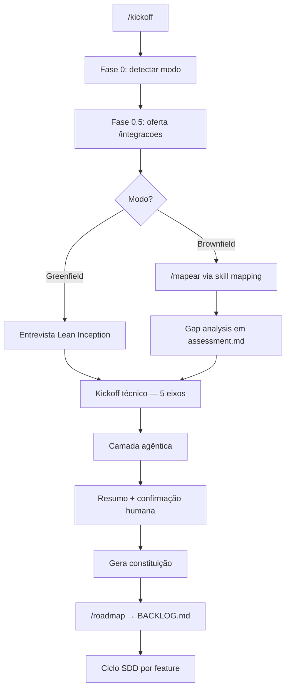

# sdd_harness_engineering

Template funcional de **Spec-Driven Development (SDD)** + **Harness Engineering**
para desenvolvimento assistido por IA.

---

## O que é isso?

| Conceito | O que faz |
|----------|-----------|
| **SDD** | Nenhum código de feature sem spec aprovada. Requisitos → design → tasks → código → revisão. |
| **Harness** | Infraestrutura que disciplina o agente: subagentes, skills, hooks, memória. |

```
Humano aprova spec  →  Agente implementa  →  sdd-review (QA + reviewer)
        ↑                                              ↓
   Hook bloqueia código sem spec aprovada
```

---

## Estrutura geral (independente do modelo de IA)

Pastas compartilhadas pelo processo SDD — qualquer agente de IA deve respeitar
este fluxo, mesmo que o harness de configuração mude por ferramenta.

```
.
├── AGENTS.md              # Processo SDD — COMO trabalhar (leitura obrigatória)
├── CLAUDE.md              # Contexto técnico — O QUE construir (adaptável por IA)
├── fluxoSdd.md            # Guia visual SDD + mapa de pastas
├── CLAUDE.local.md.example
├── .sdd/config.json       # Paths protegidos + comandos test/build/lint
│
├── specs/                 # SDD — especificações (fonte de verdade)
│   ├── BACKLOG.md         # Lista priorizada de features
│   ├── README.md          # Guia da pasta specs
│   └── features/
│       └── NNN-nome/      # requirements.md, design.md, tasks.md, status.json
│
├── progress/              # Logs de implementação por feature (impl_<id>.md)
├── tests/                 # Testes com marcador // @covers R<n>
├── docs/architecture/     # assessment.md — arquitetura desejada (lido pelo QA)
├── docs/integrations/     # inventory.md — ferramentas conectadas via /integracoes
└── src/                   # Código de produção (protegido pelo hook SDD)
```

| Pasta / arquivo | Função |
|-----------------|--------|
| `specs/BACKLOG.md` | Backlog priorizado — ideias entram aqui como `pending` |
| `specs/features/NNN-nome/` | Spec completa de uma feature antes de codar |
| `specs/features/*/status.json` | Estado: `pending` → `spec_ready` → `in_progress` → `done` |
| `progress/impl_<id>.md` | Registro task ↔ requisito ↔ arquivos ↔ testes |
| `progress/current.md` | Feature ativa (gitignored — cópia de trabalho) |
| `tests/` | Prova rastreável de que cada `R<n>` foi implementado |
| `docs/architecture/assessment.md` | Bounded contexts e restrições — validado pelo QA na revisão |
| `docs/integrations/inventory.md` | Ferramentas do time e insumos read-first — preenchido por `/integracoes` |
| `.sdd/config.json` | Diretórios bloqueados pelo hook e comandos de validação |

---

## Rastreabilidade

Cada feature usa IDs encadeados:

```
requirements.md     tasks.md              tests/
    R1 ────────────── T1 (R1) ──────────── // @covers R1
    R2 ────────────── T2 (R2) ──────────── // @covers R2
```

O `sdd-review` coordena **quality-assurance** (funcionamento + paridade + arquitetura)
e **reviewer** (rastreabilidade R\<n\> ↔ task ↔ teste). A feature só fecha com ambos ✅.

Exemplo de formato: `specs/features/000-exemplo-sdd/`.

---

## Skill kickoff (`/kickoff`)

Ponto de entrada do projeto no boilerplate SDD. **Não implementa código** — conduz uma
entrevista estruturada, define a **constituição técnica** do repositório e prepara o
terreno para o ciclo SDD feature a feature.

Acione com **`/kickoff`** ao iniciar um projeto do zero (greenfield), alinhar código
existente (brownfield) ou retomar a configuração do harness.

### Fluxograma



### Fase 0 — Detectar o modo

O agente inspeciona manifests (`package.json`, `pyproject.toml`, …), `src/`, histórico
git e docs existentes. Depois confirma com você:

| Modo | Quando |
|------|--------|
| **Greenfield** | Repo vazio ou só boilerplate |
| **Brownfield** | Já existe produto/código |
| **Híbrido** | Base existe, mas arquitetura será repensada |

Também lê `README.md` e `CLAUDE.md` para alinhar com a esteira SDD do template.

### Fase 0.5 — Integrações (opcional)

Oferece conectar ferramentas via **`/integracoes`** (MCPs, hospedagem, etc.):

- **Antes** — insumos reais para a constituição (recomendado)
- **Depois** — vira item do roadmap
- O kickoff **não levanta ferramentas** — isso é trabalho exclusivo de `/integracoes`

### Rota A — Greenfield (do zero)

**1. Lean Inception (produto)** — entrevista em lotes curtos (máx. 4 perguntas):

- **Visão** — problema, usuário, sucesso em 6–12 meses
- **MVP** — mínimo para validar, prazo, referências
- **Restrições** — compliance, SLA, o que fica fora do escopo

**2. Kickoff técnico (5 eixos)** — propõe 2–3 opções com trade-offs por eixo:

| Eixo | Exemplos |
|------|----------|
| Tech stack | linguagem, runtime, frameworks |
| Arquitetura | monólito vs microserviços, bounded contexts |
| Infra | cloud, containers, segredos |
| Qualidade | testes, CI/CD, lint |
| Observabilidade | logs, métricas, tracing |

Decisões ramificadas → skill **`/clarificar`**.

**3. Camada agêntica** — subagentes extras, skills de domínio, hooks adicionais, CI.

### Rota B — Brownfield (código existente)

**1. Mapeamento as-is (obrigatório)** — executa **`/mapear`**
(`.claude/skills/mapping/SKILL.md`). Não substitua por grep ad hoc.

Produz: stack inferida, maturidade nos 5 eixos, dívidas, ADRs retroativos e
`docs/architecture/assessment.md`. Só pergunta o que o código não revela (North Star,
dores, o que não pode quebrar, time).

**2–4. Gap → técnico → agêntica** — gap analysis vem do `/mapear`; kickoff técnico
parte do as-is (evolução, não rewrite); camada agêntica igual ao greenfield.

### Fase final — Constituição + roadmap

Antes de gravar arquivos, apresenta resumo e espera **"ok"** ou ajustes (modo, stack,
arquitetura, MVP/North Star, gaps, camada agêntica).

| Arquivo | Conteúdo gerado |
|---------|-----------------|
| `CLAUDE.md` | stack, domínio, quirks, comandos |
| `CLAUDE.local.md` | preferências locais |
| `.sdd/config.json` | paths protegidos, test/build/lint |
| `docs/architecture/assessment.md` | arquitetura inicial ou as-is + gaps |
| `docs/architecture/adr/` | decisões (iniciais ou retroativas) |

O kickoff **não escreve** `specs/BACKLOG.md`. A lista bruta de features vai para
**`/roadmap`**, único dono do backlog — agrupa por bounded context e formata corretamente.

### Depois do kickoff

```
/roadmap          →  BACKLOG.md organizado
/integracoes      →  (se ficou pendente)
"Nova feature: …" →  /sdd-init  →  "Aprovado"  →  /sdd-implement  →  /sdd-review
```

### Princípios de condução

- Perguntas em **lotes curtos** com default recomendado
- **Não inventa** arquitetura — propõe opções, você decide
- **Confirma resumo** antes de gerar arquivos; **gera tudo no fim**, de uma vez
- Tasks do roadmap ficam **resumidas** — detalhe vem depois no `sdd-init`

Skill completa: [`.claude/skills/kickoff/SKILL.md`](./.claude/skills/kickoff/SKILL.md)

### Skills complementares

| Skill | Comando | Função |
|-------|---------|--------|
| **integracoes** | `/integracoes` | Levanta ferramentas do time, conecta MCPs (read-only), grava `docs/integrations/inventory.md` |
| **clarificar** | `/clarificar` | Sabatina para decisões ramificadas (stack ↔ arquitetura ↔ infra); gera ADR |

Detalhes: [integracoes](./.claude/skills/integracoes/SKILL.md) · [clarificar](./.claude/skills/clarificar/SKILL.md)

---

## Guias por modelo de IA

Cada ferramenta de IA tem seu próprio harness de configuração. Expanda a aba do
modelo que você está usando.

<!-- Futuras abas: Cursor, Codex, Gemini CLI, etc. -->

<details open>
<summary><strong>Claude Code</strong></summary>

### Visão geral

O Claude Code lê `.claude/settings.json` na raiz do projeto e aplica hooks,
permissões e subagentes automaticamente. Os arquivos `AGENTS.md` e `CLAUDE.md`
são carregados como contexto de projeto no início da sessão.

```
Harness Claude Code (.claude/)          SDD (specs/)              Código
─────────────────────────────          ─────────────              ──────
agents/     → 5 subagentes            features/*/requirements    src/
skills/     → kickoff, integracoes,   features/*/design.md       tests/
              clarificar, mapear,      features/*/tasks.md        progress/
              roadmap, sdd-*           features/*/status.json
hooks/      → disciplina              docs/architecture/
knowledge/  → memória longa             assessment.md
session-context/ → memória curta       docs/integrations/
                                        inventory.md
```

---

### Pastas e arquivos do harness

#### `.claude/agents/` — Subagentes especializados

Cada arquivo define um papel com instruções, ferramentas permitidas e limites
de edição. O Claude Code pode invocá-los via Task tool ou quando você pede
explicitamente (*"atue como leader"*).

| Arquivo | Papel | Pode editar código? |
|---------|-------|---------------------|
| `leader.md` | Orquestra o fluxo SDD, mantém `session-context/`, atualiza `status.json` e `BACKLOG.md` | ❌ |
| `spec_author.md` | Escreve `requirements.md`, `design.md`, `tasks.md` em `specs/features/<id>/` | ❌ (só specs) |
| `implementer.md` | Executa `tasks.md`, marca `[x]`, registra em `progress/`, escreve testes | ✅ |
| `quality-assurance.md` | Roda build/lint/test, valida paridade, design e `docs/architecture/assessment.md` | ❌ |
| `reviewer.md` | Audita rastreabilidade R\<n\> ↔ task ↔ teste e escopo | ❌ |

---

#### `.claude/skills/` — Skills

Skills são acionadas por comandos naturais ou `/nome`. Cada skill fica em sua própria pasta com `SKILL.md`.

**Skills de início de projeto**

| Skill | Comando | Quando usar |
|-------|---------|-------------|
| `kickoff` | `/kickoff` | Iniciar ou retomar projeto — detecta greenfield/brownfield, conduz Lean Inception ou mapeamento, produz a constituição do projeto |
| `integracoes` | `/integracoes` | Conectar ferramentas do time (MCP read-first) → `docs/integrations/inventory.md` |
| `clarificar` | `/clarificar` | Sabatina para decisões arquiteturais ramificadas → ADR |
| `mapping` | `/mapear` | Mapear codebase existente (brownfield) — stack, arquitetura, bounded contexts, gaps nos 5 eixos, ADRs retroativos |
| `roadmap` | `/roadmap` | Agrupar features por contexto de domínio e escrever o `specs/BACKLOG.md` organizado |

**Skills do ciclo SDD (por feature)**

| Skill | Comando | Quando usar |
|-------|---------|-------------|
| `sdd-init` | `"Nova feature: …"` | Criar spec (`requirements.md`, `design.md`, `tasks.md`) para uma feature do backlog |
| `sdd-implement` | `"Implemente a feature NNN"` | Executar `tasks.md` após aprovação humana |
| `sdd-review` | `"Revise a feature NNN"` | Coordena **QA + reviewer**; consolida veredito final |

**Fluxo entre skills:**

```
/integracoes (opcional) → /kickoff → /mapear (brownfield) → /clarificar (se ramificar) → /roadmap → ciclo sdd-*
```

---

#### `.claude/hooks/` — Disciplina automática

Scripts shell registrados em `.claude/settings.json`. Rodam sem intervenção manual.

| Hook | Arquivo | Evento | Função |
|------|---------|--------|--------|
| Session start | `session-start.sh` | Início de sessão | Exibe feature ativa, status de todas as features e próximos passos |
| Pre tool use | `pre-tool-use.sh` | Antes de Edit/Write | Bloqueia edição em paths protegidos (`.sdd/config.json`) se não houver spec em `spec_ready` ou `in_progress` |

**Como o hook valida:**

1. Lê `.claude/session-context/active-feature` (ID da feature, ex: `001-user-auth`)
2. Consulta `specs/features/<id>/status.json`
3. Permite edição em `src/` (e paths extras) só se status = `spec_ready` ou `in_progress`

**Desligar temporariamente** (bootstrap inicial):

```bash
SDD_ENFORCE=false claude
```

---

#### `.claude/knowledge/` — Memória longa

Persiste aprendizados entre sessões. O `leader`, `quality-assurance` e `reviewer`
atualizam ao fechar features.

| Arquivo | Função |
|---------|--------|
| `decision-log.md` | ADRs — decisões arquiteturais imutáveis |
| `learned-lessons.md` | Lições datadas descobertas durante implementação |
| `project-glossary.md` | Termos do domínio para alinhar specs e código |

---

#### `.claude/session-context/` — Memória curta

Estado da sessão corrente. A pasta é gitignored (exceto `.gitkeep`).

| Arquivo | Função |
|---------|--------|
| `active-feature` | Uma linha com o ID da feature ativa — lida pelo hook SDD |
| `next-steps.md` | Próximas ações recomendadas pelo `leader` |
| `progress.md` | Plano vivo da sessão |
| `decisions.md` | Decisões tomadas nesta sessão |

---

#### `.claude/settings.json` — Configuração do harness

Define permissões de ferramentas (allow / ask / deny) e registra os hooks.
Também exporta `SDD_ENFORCE=true` por padrão.

---

### Arquivos raiz lidos pelo Claude Code

| Arquivo | Função | Quando |
|---------|--------|--------|
| `AGENTS.md` | Processo SDD, subagentes, ciclo de features | Início de sessão |
| `CLAUDE.md` | Stack, domínio, quirks, comandos do projeto | Início de sessão |
| `CLAUDE.local.md` | Preferências pessoais (não versionado) | Início de sessão |
| `fluxoSdd.md` | Referência visual do fluxo completo | Consulta |

---

### Ciclo de funcionamento

**Fase 1 — Início de projeto** (rode uma vez por projeto)

```
1. claude                          → abre sessão na raiz do projeto
        │
        ▼
2. session-start.sh                → mostra feature ativa + status das features
        │
        ▼
3. /kickoff                        → detecta greenfield ou brownfield
        │   greenfield: Lean Inception (visão, MVP, 5 eixos técnicos)
        │   brownfield: aciona /mapear → lê código, infere contextos, gap analysis
        ▼
4. /roadmap                        → agrupa features por bounded context
        │                              escreve specs/BACKLOG.md organizado
        ▼
5. Constituição salva              → CLAUDE.md, .sdd/config.json, assessment.md
```

**Fase 2 — Ciclo SDD por feature** (repete para cada item do backlog)

```
6. "Nova feature: <título>"        → skill sdd-init
        │                              cria specs/features/NNN-nome/
        ▼
7. Revise requirements/design/tasks → diga "Aprovado"
        │
        ▼
8. "Implemente a feature NNN"      → skill sdd-implement
        │                              pre-tool-use.sh libera src/
        │                              implementer executa tasks.md [x]
        ▼
9. "Revise a feature NNN"          → skill sdd-review
        │                              quality-assurance (funcionamento + paridade)
        │                              reviewer (R<n> ↔ // @covers R<n>)
        │                              ambos devem aprovar
        ▼
10. Leader marca done              → status.json = done, BACKLOG atualizado
```

| Você diz | Skill acionada | O que acontece |
|----------|----------------|----------------|
| `/integracoes` | **integracoes** | Inventário de ferramentas + insumos read-first |
| `/clarificar` | **clarificar** | Decisão ramificada → ADR |
| `/kickoff` | **kickoff** | Entrevista ou mapeamento → constituição do projeto |
| `/mapear` | **mapping** | Retrato do codebase → `docs/architecture/assessment.md` |
| `/roadmap` | **roadmap** | Features agrupadas por contexto → `specs/BACKLOG.md` |
| `Nova feature: autenticação JWT` | **sdd-init** | Cria spec em `specs/features/001-.../` |
| _(revise os 3 arquivos)_ | — | — |
| `Aprovado` | — | Hook libera edição em `src/` |
| `Implemente a feature 001` | **sdd-implement** | Código + testes |
| `Revise a feature 001` | **sdd-review** | QA + reviewer; veredito consolidado |
| _(QA ✅ + Reviewer ✅)_ | **leader** | Marca `done` no BACKLOG |

---

### Início rápido

```bash
# 1. Copiar o template
cp -r ./sdd_harness_engineering ./meu-projeto
cd ./meu-projeto

# 2. Abrir Claude Code
claude

# 3. Diga: /kickoff
#    O Claude detecta greenfield ou brownfield e conduz você pelas fases:
#    entrevista → mapeamento (se brownfield) → 5 eixos → constituição
#
# 4. Diga: /roadmap
#    Agrupa as features levantadas por contexto e escreve o BACKLOG.md
#
# 5. Para cada feature do backlog, diga:
#    "Nova feature: <título>"  →  revise  →  "Aprovado"  →  "Implemente"  →  "Revise"
```

**`.sdd/config.json`** — exemplo com monorepo:

```json
{
  "protectedPaths": ["src", "apps/web", "packages/api"],
  "testCommand": "npm test",
  "buildCommand": "npm run build",
  "lintCommand": "npm run lint"
}
```

---

### Adicionar skills de stack (opcional)

```bash
# Exemplo: skill de boas práticas para seu framework
npx skills add <nome-da-skill>
```

Documente skills instaladas e quando aplicá-las em `CLAUDE.md`.

</details>

---

## Documentação relacionada

- [AGENTS.md](./AGENTS.md) — processo e subagentes
- [fluxoSdd.md](./fluxoSdd.md) — fluxo visual e mapa de pastas
- [.claude/skills/integracoes/SKILL.md](./.claude/skills/integracoes/SKILL.md) — skill `/integracoes`
- [.claude/skills/clarificar/SKILL.md](./.claude/skills/clarificar/SKILL.md) — skill `/clarificar`
- [.claude/skills/kickoff/SKILL.md](./.claude/skills/kickoff/SKILL.md) — skill `/kickoff` completa
- [specs/README.md](./specs/README.md) — guia da pasta specs (prelude + ciclo por feature)
- [tests/README.md](./tests/README.md) — convenção `@covers`
