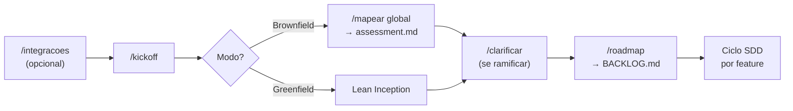
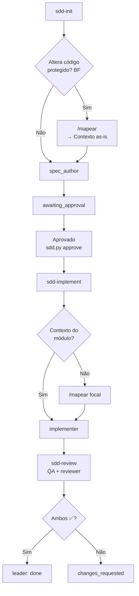
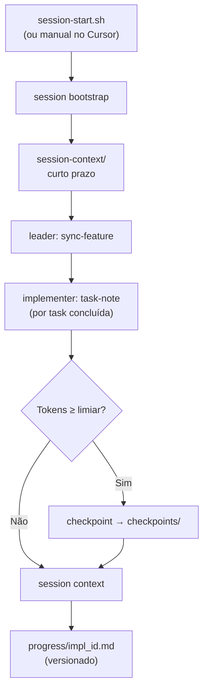

# Fluxo SDD — Desenvolvimento com Claude Code

> Spec-Driven Development (SDD) deste template. Nenhum código de feature é escrito
> sem **especificação aprovada por humano**. Processo completo também em `AGENTS.md`
> e `specs/README.md`. Diagramas expandidos: **`README.md`** (Fluxos principais).

---

## Regra de ouro

**Sem spec aprovada, sem código.**

O hook `.claude/hooks/pre-tool-use.sh` bloqueia edições em diretórios protegidos
(`.sdd/config.json` → `protectedPaths`) quando a feature não está em `approved`/`in_progress`
ou a spec mudou após aprovação.

---

## Prelude do projeto (uma vez)



---

## Ciclo SDD por feature



| # | Fase | Skill / agente | Status | Artefato |
|---|------|----------------|--------|----------|
| 0 | Mapeamento (BF) | `/mapear` | — | `assessment.md`, ADRs |
| 1 | Descoberta | `/roadmap` | `pending` | `BACKLOG.md` |
| 2 | Especificação | `sdd-init` → `spec_author` | `awaiting_approval` | requirements, design, tasks |
| 3 | Aprovação | humano + `leader` | `approved` | `sdd.py approve` + digest |
| 4 | Implementação | `sdd-implement` + `/mapear` focal | `in_progress` | código, `progress/impl_*.md` |
| 5 | Revisão | `sdd-review` | `in_review` / `verified` | `reviews/` + `review record` |
| 6 | Done | `leader` | `done` | BACKLOG atualizado |

---

## `/mapear` global vs focal

| Tipo | Quando | Saída |
|------|--------|-------|
| **Global** | Kickoff brownfield | `docs/architecture/assessment.md` |
| **Focal** | `sdd-init` ou `sdd-implement` | `design.md` (as-is) e/ou `progress/impl_<id>.md` (Contexto do módulo) |

---

## Memória de sessão

Infraestrutura paralela ao SDD — spec `memory/memory.md`, ADR `docs/architecture/adr/001-session-context.md`.



| Nível | Pasta | Git |
|-------|-------|-----|
| Curto prazo | `.claude/session-context/` (`global/`, `features/<id>/`) | Ignorado (exceto `_templates/`) |
| Longo prazo | `.claude/knowledge/checkpoints/` | Ignorado |
| Lições | `.claude/knowledge/learned-lessons.md` | Versionado |
| Por task | `progress/impl_<id>.md` | Versionado |

```bash
python3 .sdd/sdd.py session bootstrap|context|sync-feature|task-note|status|checkpoint
python3 -m unittest discover -s tests/harness -v
```

---

## Estrutura de uma feature

```
specs/features/NNN-nome/
├── requirements.md   # FNNN-R1, FNNN-R2, ... (formato EARS)
├── design.md         # decisões + File Structure Plan + Contexto as-is
├── tasks.md          # FNNN-T1, ... (RED → GREEN → REFACTOR)
├── status.json       # estado + approval + reviews
└── reviews/          # relatórios QA e rastreabilidade
```

Exemplo: `specs/features/000-exemplo-sdd/`.

---

## Rastreabilidade FNNN-R\<n\>

```
requirements.md     tasks.md              tests/
 F001-R1 ───────── F001-T1 (F001-R1) ───── @covers F001-R1
```

Revisão (`sdd-review`): **QA + reviewer** — feature só fecha com ambos ✅.
Relatórios: `python3 .sdd/sdd.py review record <id> --kind qa|traceability ...`

---

## Mapa de pastas

### SDD

| Pasta | Função |
|-------|--------|
| `specs/` | Fonte de verdade — o que será construído |
| `specs/BACKLOG.md` | Backlog priorizado |
| `progress/` | Log `impl_<id>.md` + Contexto do módulo |
| `tests/` | `@covers FNNN-R<n>` + `tests/harness/` (Python) |
| `docs/architecture/` | `assessment.md`, `adr/` |
| `.sdd/` | `config.json`, `sdd.py`, `migrate_session_context.py` |

### Harness (`.claude/`)

| Pasta | Função |
|-------|--------|
| `.claude/agents/` | leader, spec_author, implementer, QA, reviewer |
| `.claude/skills/` | kickoff, integracoes, mapear, clarificar, roadmap, sdd-* |
| `.claude/hooks/` | `session-start.sh`, `pre-tool-use.sh` |
| `.claude/knowledge/` | session_manager.py, checkpoints/, lições, glossário |
| `.claude/session-context/` | Memória curta (gitignored) |

---

## Harness + SDD (visão integrada)

```
Harness (veículo)                      SDD (processo)                    Código
─────────────────                      ──────────────                    ──────
.claude/agents/     → subagentes       specs/features/*/requirements.md  src/
.claude/skills/     → instruções       specs/features/*/design.md        tests/
.claude/knowledge/  → memória longa    specs/features/*/tasks.md
.claude/hooks/      → disciplina       specs/features/*/status.json      progress/
session-context/    → memória curta (sync-feature, task-note)
checkpoints/        → pós-checkpoint
memory/memory.md    → spec operacional de memória
```

---

## Passo a passo no Claude Code

1. `cd seu-projeto && claude` — hook `session-start.sh` carrega memória e status.
2. Prelude (uma vez): `/kickoff` → `/roadmap`.
3. Por feature: **"Nova feature: …"** → revise spec → **"Aprovado"** → **"Implemente"** → **"Revise"**.
4. Brownfield: `/mapear` focal antes de codar se `## Contexto do módulo` estiver vazio.

---

## Desligar temporariamente o hook SDD

```bash
SDD_ENFORCE=false claude
```

Use só para bootstrap inicial.
