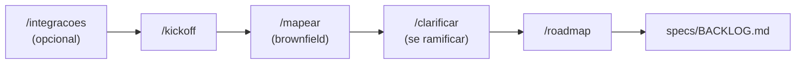

# specs/ — Coração do Spec-Driven Development (SDD)

Esta pasta é a **fonte de verdade** do que será construído. Nenhum código de
feature é escrito sem uma spec aprovada aqui. Orquestração completa: **`AGENTS.md`**
(raiz). Guia visual: **`fluxoSdd.md`**.

---

## O que vive aqui

```
specs/
├── README.md            # este guia
├── BACKLOG.md           # features priorizadas (don o: skill /roadmap)
└── features/
    └── NNN-nome/
        ├── requirements.md   # FNNN-R1, FNNN-R2, … (formato EARS)
        ├── design.md         # decisões + File Structure Plan + Contexto as-is
        ├── tasks.md          # FNNN-T1, … com referência a FNNN-R<n>
        ├── status.json       # estado + aprovação + revisões
        └── reviews/          # relatórios persistidos de QA e rastreabilidade
```

| Arquivo | Função |
|---------|--------|
| `BACKLOG.md` | Ideias e features **antes** da spec detalhada — organizado por bounded context via `/roadmap` |
| `features/NNN-nome/` | Spec completa de **uma** feature |
| `features/*/status.json` | Estado da feature; o hook SDD consulta antes de liberar código |

**Fora de `specs/` mas ligado ao fluxo:**

| Arquivo | Relação com specs |
|---------|-------------------|
| `docs/architecture/assessment.md` | As-is e gaps — alimenta `design.md` → `## Contexto as-is` |
| `docs/integrations/inventory.md` | Ferramentas reais (via `/integracoes`) — enriquece requisitos e design |
| `docs/architecture/adr/` | Decisões ramificadas (via `/clarificar`) — referenciar em `design.md` |
| `progress/impl_<id>.md` | Log de implementação + `## Contexto do módulo` |

---

## Antes do primeiro item no BACKLOG

Rode **uma vez por projeto** (ou ao retomar após mudança grande):



| Skill | Comando | Papel em relação a `specs/` |
|-------|---------|-------------------------------|
| Integrações | `/integracoes` | Inventário de ferramentas → insumos para specs mais realistas |
| Kickoff | `/kickoff` | Constituição do projeto (`CLAUDE.md`, assessment) |
| Mapeamento | `/mapear` | `assessment.md` — obrigatório antes de spec em código existente |
| Clarificar | `/clarificar` | Sabatina → ADR quando decisão arquitetural bloqueia o design |
| Roadmap | `/roadmap` | **Único dono** do `BACKLOG.md` — agrupa por bounded context |

> **`/roadmap` escreve o BACKLOG.** O `/kickoff` passa lista bruta; não duplique formato.

---

## Ciclo SDD por feature

Depois que o item está no `BACKLOG.md`:

```
┌─────────────┐   ┌──────────────┐   ┌──────────┐   ┌──────────────┐   ┌──────────┐   ┌──────┐
│ 1.Descoberta│ → │2.Especificação│ → │3.Aprovação│ → │4.Implementação│ → │5.Revisão │ → │6.Done│
│  BACKLOG.md │   │  sdd-init     │   │  HUMANO  │   │ sdd-implement │   │sdd-review│   │leader│
│  pending    │   │awaiting_appr. │   │ approved  │   │  in_progress  │   │in_review │   │ done │
└─────────────┘   └──────────────┘   └──────────┘   └──────────────┘   └──────────┘   └──────┘
```

| # | Fase | Skill / agente | Artefato |
|---|------|----------------|----------|
| 0 | Mapeamento (brownfield) | `/mapear` focal se módulo novo | `design.md` → `## Contexto as-is` |
| 1 | Descoberta | item já no `BACKLOG.md` | `pending` |
| 2 | Especificação | `sdd-init` → `spec_author` | `requirements.md`, `design.md`, `tasks.md` |
| 2b | Decisão ambígua | `/clarificar` → ADR | referência em `design.md` |
| 3 | Aprovação | humano + `leader` | aprovação persistida → `approved` |
| 4 | Implementação | `sdd-implement` → `implementer` | `tasks.md` `[x]`, `progress/impl_*.md` |
| 5 | Revisão | `sdd-review` | `in_review` + relatórios persistidos |
| 6 | Done | `leader` | `verified` → `done`, BACKLOG atualizado |

### Comandos naturais

| Você diz | O que acontece |
|----------|----------------|
| `Nova feature: autenticação JWT` | `sdd-init` — cria `specs/features/001-.../` |
| _(revise os 3 arquivos)_ | — |
| `Aprovado` | Leader persiste aprovação + digest; hook libera código |
| `Implemente a feature 001` | `sdd-implement` |
| `Revise a feature 001` | `sdd-review` (QA + reviewer) |

---

## Estados (`status.json`)

| Status | Significado | Pode editar código? |
|--------|-------------|---------------------|
| `pending` | No backlog, spec incompleta | ❌ |
| `awaiting_approval` | Spec pronta, aguardando humano | ❌ |
| `approved` | Humano aprovou o digest atual | ✅ |
| `in_progress` | Implementação em andamento | ✅ |
| `in_review` | QA e reviewer em execução | ❌ |
| `changes_requested` | Revisão pediu mudanças | ❌ |
| `verified` | QA e reviewer aprovaram | ❌ |
| `done` | Implementada, revisada e rastreável | ❌ |

O hook `.claude/hooks/pre-tool-use.sh` bloqueia paths em `.sdd/config.json`
(envelope padrão: `src/`) quando a feature ativa **não** está em `approved`
ou `in_progress`, ou quando a spec mudou após aprovação.

---

## Conteúdo de cada arquivo da spec

### `requirements.md` — EARS + FNNN-R\<n\>

- **F001-R1**, **F001-R2**, … — requisitos rastreáveis sem ambiguidade
- Padrões: ubíquo, event-driven, state-driven, unwanted
- Use insumos de `docs/integrations/inventory.md` quando relevante (APIs, ambientes)

### `design.md` — decisões + plano

Seções esperadas:

- **`## Contexto as-is`** — brownfield: resumo de `assessment.md` + módulos tocados
- **Decisões técnicas** — alternativas consideradas; cite ADR se veio de `/clarificar`
- **File Structure Plan** — arquivos a criar/alterar
- **Mapeamento FNNN-R\<n\> → módulos**

### `tasks.md` — checklist

- **F001-T1**, **F001-T2**, … — cada task referencia requisitos qualificados
- Cada task executa RED → GREEN → REFACTOR e usa `@covers FNNN-R<n>`

### `status.json`

```json
{
  "id": "001-user-auth",
  "title": "Autenticação de usuário",
  "status": "awaiting_approval",
  "created": "2026-06-22",
  "updated": "2026-06-22",
  "approval": null,
  "reviews": {
    "qa": { "status": "pending", "report": null },
    "traceability": { "status": "pending", "report": null }
  }
}
```

Após aprovação explícita:

```bash
python3 .sdd/sdd.py approve 001-user-auth --by "nome-ou-email"
```

## Rastreabilidade FNNN-R\<n\>

```
requirements.md     tasks.md              tests/
 F001-R1 ───────── F001-T1 (F001-R1) ───── @covers F001-R1
 F001-R2 ───────── F001-T2 (F001-R2) ───── @covers F001-R2
```

| Agente | Critério de reprovação (via `sdd-review`) |
|--------|-------------------------------------------|
| **reviewer** | Algum requisito sem task **ou** sem `@covers FNNN-R<n>` |
| **quality-assurance** | Build/lint/test falham; regressão não documentada; violação de `design.md` ou `assessment.md` |

Feature só fecha com **ambos** ✅.

---

## Brownfield — regras extras

Se o projeto **já tem código** (não é greenfield puro):

1. **`/mapear`** antes de `sdd-init` quando a feature toca paths protegidos e o módulo
   não está em `assessment.md`.
2. **`design.md`** deve ter **`## Contexto as-is`** preenchido.
3. **`sdd-implement`** registra **`## Contexto do módulo`** em `progress/impl_<id>.md`.
4. Decisão estrutural em aberto → **`/clarificar`** antes de fechar o design.

---

## Convenção de nomes

`NNN-kebab-case` — número sequencial global + nome curto.

Exemplos: `001-user-auth`, `002-api-pagination`.

Referência de formato: **`specs/features/000-exemplo-sdd/`** (modelo, não produção).

---

## Como adicionar a primeira feature real

1. Rode **`/kickoff`** → **`/roadmap`** (BACKLOG organizado).
2. Opcional: **`/integracoes`** para insumos de ferramentas reais.
3. Escolha item do BACKLOG → **`Nova feature: <título>`** (`sdd-init`).
4. Se design travar → **`/clarificar`**.
5. Revise → **`Aprovado`** → **`Implemente`** → **`Revise`**.
